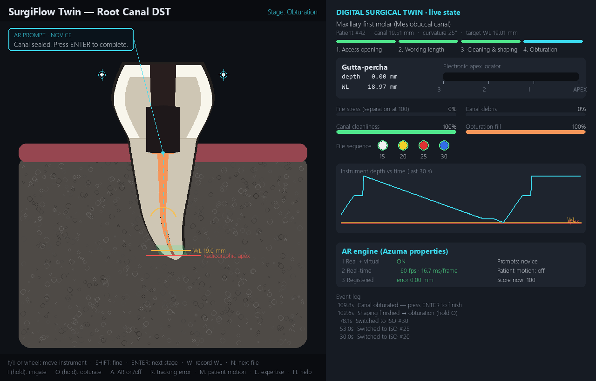
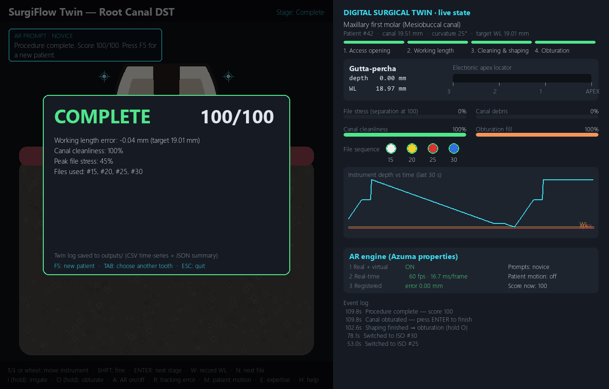

# SurgiFlow Twin — UROP Project

**Real-time operating-room Digital Surgical Twins (DSTs) with adaptive AR prompts**

Last updated: 7 October 2026

---

## Project goal
Build a series of **Digital Surgical Twins (DSTs)**, named *SurgiFlow*, in **Unity**, and publish them.
A DST is a live virtual copy of the patient anatomy, the instruments and the procedure state, driven by
the operator's actions in real time. On top of it, an **Augmented Reality (AR)** layer gives adaptive,
anatomy-anchored guidance designed around **Azuma's (1997) three properties of AR**:

1. **Combines real and virtual** content
2. **Interactive in real time**
3. **Registered in 3D** (virtual content stays aligned with the real anatomy)

## Progress summary

| # | Milestone | Status |
|---|---|---|
| 1 | Concept & literature: DSTs and Azuma's AR principles | ✅ Done |
| 2 | Anatomy dataset collected from published sources (root canal lengths, curvature, apical diameter) | ✅ Done |
| 3 | **Python prototype**: interactive root-canal DST with an AR layer | ✅ Done (v0.1) |
| 4 | Learning Unity (C#, scenes, input, UI) | 🟡 In progress |
| 5 | Port the root-canal DST to Unity (3D tooth, instruments, dashboard) | ⬜ Planned |
| 6 | AR overlay in Unity (AR Foundation), registration-error experiments | ⬜ Planned |
| 7 | More SurgiFlow DST scenarios + published builds | ⬜ Planned |

## Milestone 3 — Python prototype (done)

A desktop simulation of a **root canal (endodontic) procedure** that the user controls with keyboard/mouse.
It is a working proof of concept for the DST + AR design before it is rebuilt in Unity.

**Procedure stages simulated**
1. **Access opening:** drill to the pulp chamber. Perforating the chamber floor fails the run.
2. **Working length:** advance a #10 K-file using a simulated electronic apex locator, then record the length.
3. **Cleaning & shaping:** ISO file sequence to working length, with file stress/separation, debris, irrigation and blockage modelled.
4. **Obturation:** gutta-percha fill from working length up to the canal orifice.

**Digital twin:** a live dashboard of depth, apex-locator reading, file stress, debris, canal cleanliness, fill level,
depth-vs-time chart and an event log. Each session is logged (10 Hz CSV time-series + JSON summary with score and errors).

**Azuma AR layer:**
- **Real + virtual:** virtual canal path, apical safe zone, working-length line, tip-distance labels and fiducials are drawn over the anatomy (can be toggled).
- **Real time:** updates every frame from user input; FPS / frame latency are measured and shown.
- **Registration:** overlays are anchored in the tooth coordinate frame and drawn through a simulated tracker. Tracker latency (250 ms), bias and patient motion can be injected; registration error is measured in mm, and the system warns and dims the overlays when error is above 0.5 mm.
- **Adaptive prompts:** guidance is picked by priority from the live twin state and switches between novice and expert detail. An "expert" who makes 3 or more errors automatically gets detailed guidance again.

**Data-driven patients:** every run samples a new patient (canal length, curvature) from the mean ± SD in the dataset.

| Working length with AR guidance | Mis-registration demo (tracker lag + patient motion) |
|---|---|
|  |  |

| Obturation | Session result |
|---|---|
|  |  |

**Verification:** an automated self-test (`python src/main.py --selftest`) completes all four stages on the hardest case
(curved mesiobuccal molar canal) with a score of 100/100. A deliberately careless run (fast, unpaused filing) correctly ends in file separation.

➡ Code, controls and full details: [`prototype-python/README.md`](prototype-python/README.md)

## Dataset
`prototype-python/data/root_canal_anatomy.csv`: six tooth/canal types with canal length (mean ± SD), curvature and apical diameter.
Sources:
- [Root canal length of anterior upper teeth by typology (ResearchGate)](https://www.researchgate.net/figure/The-root-canal-length-of-the-anterior-upper-teeth-according-to-their-typology_tbl2_322572259)
- [Krishnan et al., *Cureus* 2024: CBCT of mandibular incisors (PMC11628873)](https://pmc.ncbi.nlm.nih.gov/articles/PMC11628873/)
- [Tooth and root length measurements (ResearchGate)](https://www.researchgate.net/figure/Tooth-length-and-root-length-measurement_tbl2_283164810)
- [External and internal root canal anatomy of maxillary molars (IntechOpen)](https://www.intechopen.com/chapters/67177)

Limitations: crown dimensions and some SDs are textbook approximations. The mandibular-incisor canal length still needs its primary source confirmed. The 2D model is simplified, for education/research prototyping only and not for clinical use.

## Next steps
- Finish Unity fundamentals, then rebuild the root-canal DST as a 3D Unity scene (C# port of the twin state machine).
- Replace the 2D tooth with a 3D model (e.g. from an open CBCT/micro-CT tooth dataset).
- Add AR Foundation overlays and run registration-error experiments.
- Build further SurgiFlow DST scenarios and publish builds.

## Repository layout
```
prototype-python/   Python (pygame) root-canal DST prototype: src/, data/, run_simulation.bat
unity/              Unity SurgiFlow DST projects (coming next)
docs/images/        Screenshots used in this report
```

## Run the prototype
```
cd prototype-python
pip install -r requirements.txt
python src/main.py
```
