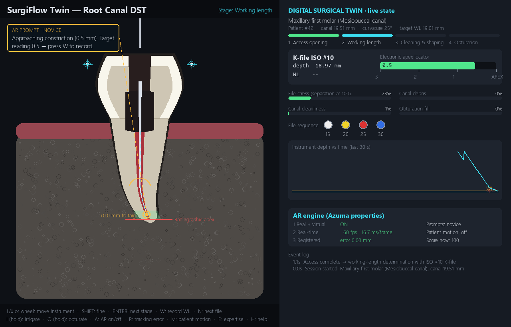
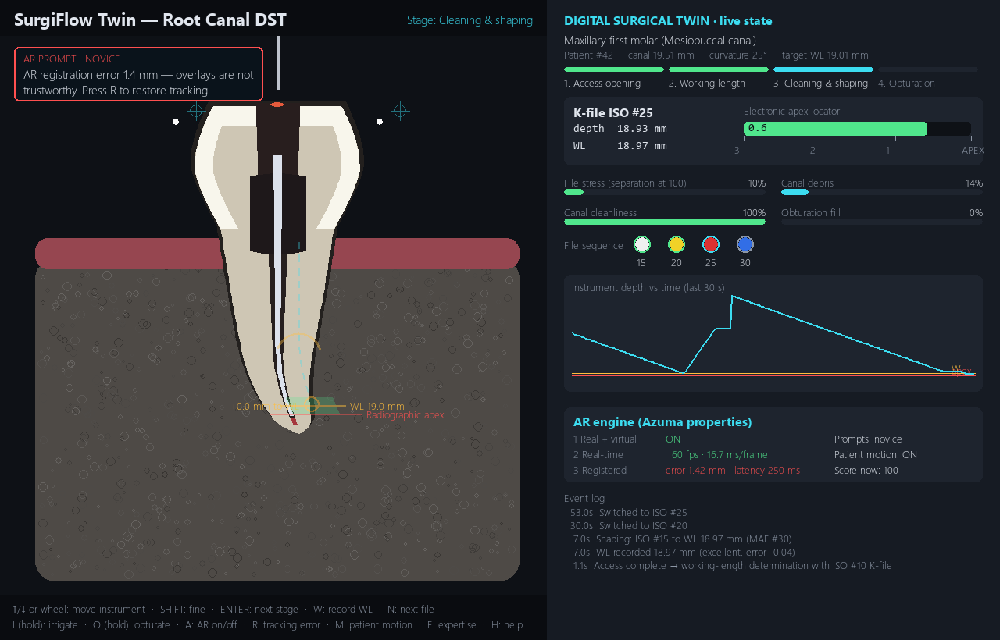

# SurgiFlow Twin — UROP Project

**Real-time operating-room Digital Surgical Twins (DSTs) with adaptive AR prompts**

## About
The aim of this project is to build **Digital Surgical Twins (DSTs)**, called *SurgiFlow*. A DST is a live
virtual copy of the patient's anatomy, the surgical instruments and the state of the procedure, updated in
real time from the operator's actions. An **Augmented Reality (AR)** layer on top gives guidance that is anchored to the anatomy and
adapts to what the operator is doing. It follows **Azuma's three properties of AR**: it combines real and virtual content, it is
interactive in real time, and it is registered in 3D.

## Introduction: root canal interactive game
As an introduction, we built a small **interactive root canal game** in Python. You play through a
simplified root canal procedure with the keyboard and mouse:

1. **Access opening:** drill down to the pulp chamber.
2. **Working length:** guide a file to the root tip using an apex-locator reading.
3. **Cleaning & shaping:** work through the file sizes and irrigate the canal.
4. **Filling (obturation):** seal the canal.

A live dashboard shows what is happening inside the tooth, and on-screen AR-style prompts guide the player.
Tooth measurements come from published dental-anatomy data, so every game gives a slightly different patient.

| Working length with AR guidance | Overlay drift demo (tracking lag + patient motion) |
|---|---|
|  |  |

| Filling the canal | End of game |
|---|---|
|  |  |

Code, controls and data sources: [`intro-root-canal-game/`](intro-root-canal-game/)

**Play it:** open `intro-root-canal-game` and double-click `play_root_canal_game.bat`, or run:
```
cd intro-root-canal-game
pip install -r requirements.txt
python src/main.py
```

## Main work: SurgiFlow DST in Unity (under development)
The main project is being built in **Unity** with **C#**. We are developing a full SurgiFlow Digital Surgical
Twin with 3D anatomy, real-time instrument tracking and AR guidance. This work is currently under process and
will be added to the [`unity/`](unity/) folder.

## Repository layout
```
intro-root-canal-game/   Introductory root canal interactive game (Python)
unity/                   SurgiFlow DST built in Unity / C# (under development)
docs/images/             Screenshots
```
